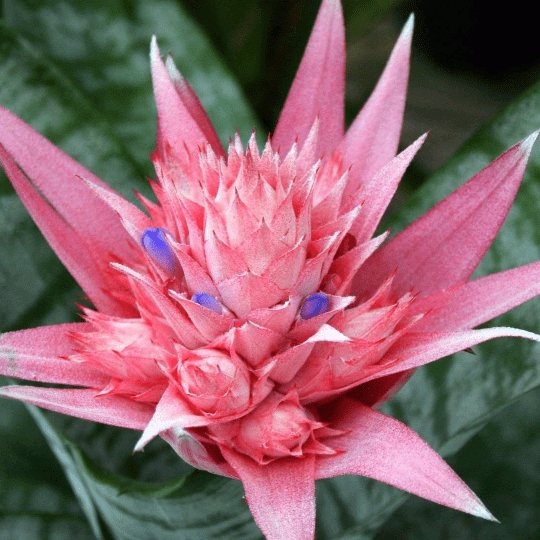

# Just Bromeliad

 
A music pack that replaces all the menu music with the track "Aaron Cherof - Bromeliad" from the Trails & Tales update, even on versions 1.19.x, 1.18.x, 1.17.x, and 1.16.x.

## 🚀 Download
You can download the resource pack [here from the GitHub releases page](https://github.com/RushanM/Just-Bromeliad/releases) or from Modrinth:

## 📛 Credits
* [**Deflecta**](https://github.com/RushanM): Resource pack
* [**Aaron Cherof**](cherof.com): Bromeliad

## 💝 Support
If you like my work enough to send me some money, you can do so at the following links:
* [Boosty](https://boosty.to/rushanm)
* [VK Pay](https://vk.me/moneysend/deflecta)
* [Donation Alerts](https://www.donationalerts.com/r/deflecta)
* [YooMoney](https://yoomoney.ru/to/410015215253910)

I will appreciate every contribution!